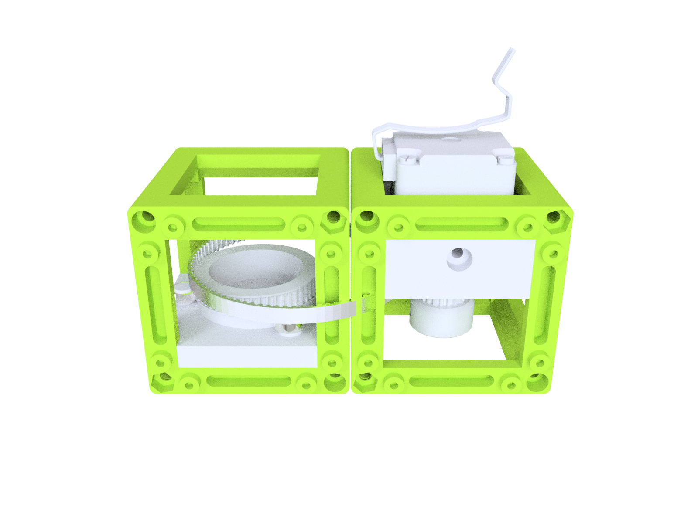
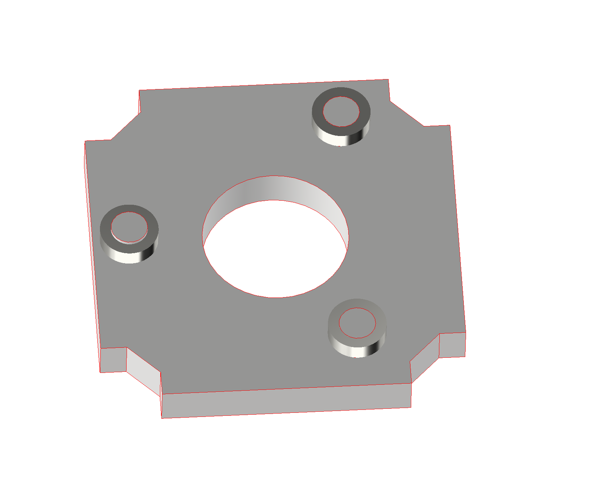
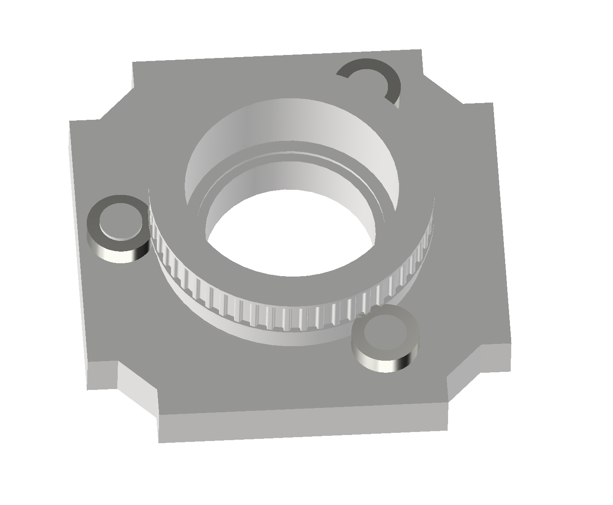
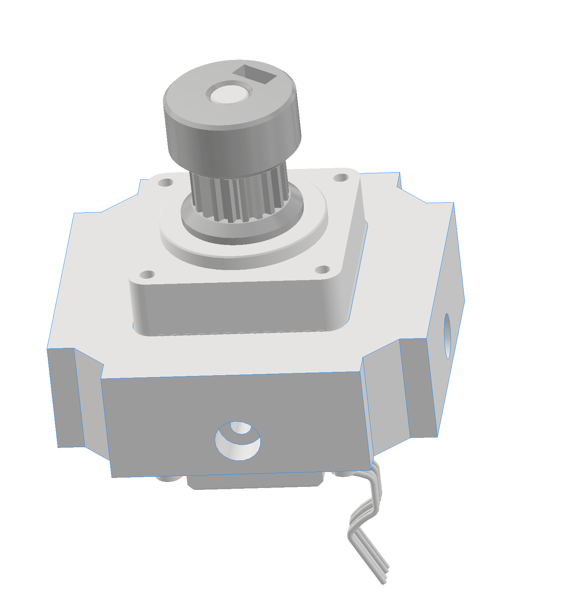
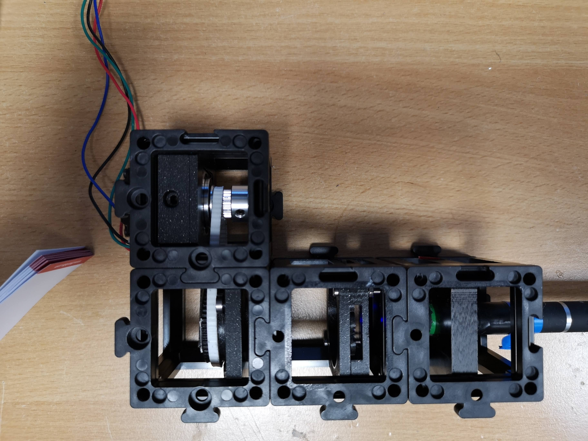

# openUC2 *Motorized Filter/Polarizer/Despeckle Rotator*
---

This repository will help you to build and setup a helpful tool to precisely rotate a 25mm filter or turn a diffuser in a fast way to randomize speckles.

Curious to see what this looks like? Keep scrolling!

The rotator is motivated by this manuscript: [Article Cover
Step-by-step guide to 3D print motorized rotation mounts for optical applications](https://opg.optica.org/ao/fulltext.cfm?uri=ao-60-13-3764&id=450413) by Nilsson et al. 

The entire assembly is 3D printed including the belts. You only need 3 ballbearings and a NEMA Motor. 

***Features:***
* Rotates at angular precision
* Holds 25mm filters

## In-Action

An earlier version with a 28BYI Motor and longer belt:

# Software

Please review a tutorial on how to control a stepper motor e.g. [here](https://www.makerguides.com/a4988-stepper-motor-driver-arduino-tutorial/). An in-detail electronics schematics acan also be found in the manuscript by  [Nilsson et al.](https://opg.optica.org/ao/fulltext.cfm?uri=ao-60-13-3764&id=450413) 

# Hardware

Below we describe how the device can be build and assembled in order to replicate the whole system as shown in the rendering above. One needs additional parts that can be found in the core [openUC2 repository](https://github.com/bionanoimaging/UC2-GIT).

## Bill of material

Below you will find all components necessary to build this device

### 3D printing files

All files (*) in the [STL](./STL)-folder need to be printed. We used a Prusa i3 MK3 using PLA Prusament (Galaxy Black) at layer height 0.3 mm and infill 100%.
The GT2 belt can either be printed using Ninjaflex or you buy one with 89 teeth. 

### Additional parts
This is used in the current version of the setup

|  Type | Details  |  Price | Link  |
|---|---|---|---|
| Nema 11 motor | Rotates the whole thing |  22 € | [e.g. Eckstein](https://eckstein-shop.de/PololuStepperMotorNEMA11Bipolar200StepsRev28C39732mm38V067APhase)  |
| 8x5x3 mm ball bearing | ensures smooth rotation |  10 € | [e.g. Vogel Modellsport](https://www.vogel-modellsport.de/Differential-Kugellager-8x5x3mm-2-Stueck-.htm?SessionId=&a=article&ProdNr=66-RA0279)  |

### Design files
The original design files are in the [INVENTOR](./INVENTOR) folder. 

### Assembly of the DEVICE

***1.*** Add the 3 ball bearings to the "pins" of the [Cube_Template_rotational_filtermount_v3_20_Cube_Insert_rotational_filtermount_v3.iam_1](./STL/Assembly_Cube_Template_rotational_filtermount_v3_20_Cube_Insert_rotational_filtermount_v3.iam_1)

***2.*** Add the rotational part to the bearings. If it does not rotate smoothly remove any "ripples" using e.g. sandpaper[Cube_Template_rotational_filtermount_v3_20_Cube_Insert_rotational_filtermount_v3_2](./STL/Assembly_Cube_Template_rotational_filtermount_v3_20_Cube_Insert_rotational_filtermount_v3_2)

***3.*** Add the NEMA11 motor to the holder. Also add the belt gear [Cube_Template_rotational_filtermount_v3_20_Cube_Insert_rotational_filtermount_v3_2](./STL/Assembly_Cube_Template_rotational_filtermount_v3_20_Cube_Insert_rotational_filtermount_v3_2)

***4.*** Put everything in to the cubes, add the belt and filter

***5.*** Done

## Showcase

Simple setup that shhows the effect of cross polarizers

***Fig 1.*** Rotation of polarizers

***Fig 2.*** Setup

## Get Involved

This project is open so that anyone can get involved. You don't even have to learn CAD designing or programming. Find ways you can contribute in  [CONTRIBUTING](https://github.com/openUC2/UC2-GIT/blob/master/CONTRIBUTING.md)

## License and Collaboration

This project is open-source and is released under the CERN open hardware license. Our aim is to make the kits commercially available.
We encourage everyone who is using our Toolbox to share their results and ideas, so that the Toolbox keeps improving. It should serve as a easy-to-use and easy-to-access general purpose building block solution for the area of STEAM education. All the design files are generally for free, but we would like to hear from you how is it going.

You're free to fork the project and enhance it. If you have any suggestions to improve it or add any additional functions make a pull-request or file an issue.

Please find the type of licenses [here](https://github.com/openUC2/UC2-GIT/blob/master/License.md)

REMARK: All files have been designed using Autodesk Inventor 2019 (EDUCATION)

## Collaborating
If you find this project useful, please like this repository, follow us on Twitter and cite the webpage! :-)
